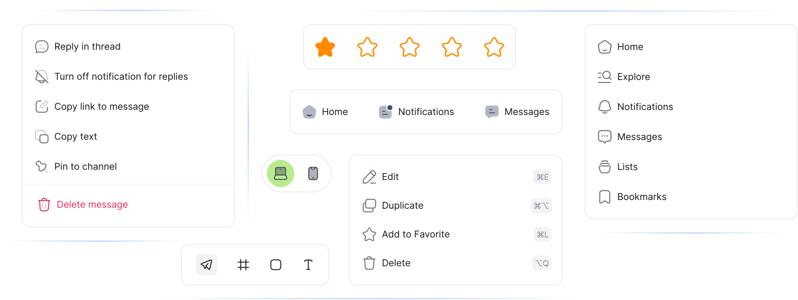

---

Welcome to the professional edition of Houston for Angular — an extensive library of meticulously crafted icons designed to elevate the visual appeal of your web and mobile applications. With Houston Angular Pro, you gain access to a vast selection of icons tailored to suit every need, allowing for highly customizable and dynamic user interfaces.

Thousands of designers, developers, and content creators use Houston Pro for unlimited personal and commercial projects, making it one of the most versatile and user-friendly icon libraries available.

Discover more at our website: [houston.com](https://houston-icons.vercel.app/)



## Table of Contents
- [Features](#features)
- [Installation](#installation)
- [Usage Examples](#usage-examples)
- [Live Example](#live-example)
- [Contributing](#contributing)
- [FAQ](#faq)
- [License](#license)

## General Usage

Icons can be downloaded from the [Houston website](https://houston-icons.vercel.app) and used in your projects. The icons are available in SVG format and can be easily integrated into your applications.

## Features

### Autocomplete for Efficiency
Swiftly find the icon you need with our intuitive autocomplete feature, streamlining your design process.

### Customizable Size
Freedom to scale: adjust icon sizes effortlessly to match your design requirements.

### Multiple Variants
Seven distinct variants ensure that you can select the perfect style to match your project's aesthetics.

### Unlimited Colors
Customize icon colors with ease, giving you the ability to maintain consistency with your brand's color palette.

### Expansive Library
Access over 27,000 icons within the library, ensuring you'll find the exact icon for every context.

## Installation

To start using HoustonIcons-Angular in your project, install the package via npm:

```bash
npm install @houstonicons/angular
```

Or via yarn:

```bash
yarn add @houstonicons/angular
```

## Usage Examples

Import the icons you need from the library and integrate them into your Angular components. Here's how you can customize the icons to fit your needs:

### Control Icon Size
Adjust the size of your icons by passing a `iconSize` input:

```typescript
import { Component } from '@angular/core';
import { Home01Icon } from '@houstonicons/angular';

@Component({
  selector: 'app-example',
  template: `<app-home01-icon [iconSize]="32"></app-home01-icon>`, // Custom size
})
export class ExampleComponent {}
```

### Customize Icon Color
Change the color of your icons by passing a `color` input:

```typescript
import { Component } from '@angular/core';
import { MarketingIcon } from '@houstonicons/angular';

@Component({
  selector: 'app-example',
  template: `<app-marketing-icon [color]="'#00FF00'"></app-marketing-icon>`, // Green color
})
export class ExampleComponent {}
```

### Adjust Icon Corners
Easily modify the corner style of your icons by using the `cornerStyle` input:

```typescript
import { Component } from '@angular/core';
import { ListSettingIcon } from '@houstonicons/angular';

@Component({
  selector: 'app-example',
  template: `<app-list-setting-icon [cornerStyle]="'rounded'"></app-list-setting-icon>`, // Rounded corners
})
export class ExampleComponent {}
```

### Control Icon Fill Type
Set the fill style of your icons using the `fillType` input:

```typescript
import { Component } from '@angular/core';
import { AddSquareIcons } from '@houstonicons/angular';

@Component({
  selector: 'app-example',
  template: `<app-add-square-icon [fillType]="'solid'"></app-add-square-icon>`, // Solid fill
})
export class ExampleComponent {}
```

## Live Example

Explore a live demonstration of Houston Angular Pro in action at [Houston Pro Example](https://houston-icons.vercel.app/use-cases). This example showcases the versatility and ease of customizing our icons to fit your design needs, providing a hands-on experience with the icon collection.

## FAQ

**Q: How can I download and use free Angular icons from Houston Angular Icons?**
A: You can install the package via npm or yarn and then import the Angular icons into your Angular components. Detailed package installation instructions are provided in the [Installation](#installation) section.

**Q: Are these Angular icons customizable in terms of size and color?**
A: Yes, all Angular icons are fully customizable. You can adjust their size, color, and other properties easily within your Angular application. See [Usage Examples](#usage-examples) for more information.

**Q: Is there a live demo where I can see these Angular icons in action?**
A: Yes, we have a live example available at [Houston Angular Example](#live-example). It showcases the usage of various Angular icons and their customization options.

**Q: Are the Angular icons from Houston Angular Icons free for commercial use?**
A: Houston Angular Pro is licensed for commercial use, adhering to the [CC0-1.0](#license). Please review the license details for more information.

---

## License

Houston Angular is licensed under the CC0 1.0 Universal (CC0 1.0) Public Domain Dedication. This means you can use, modify, distribute, and even use the icons for private or commercial purposes, without any restrictions. No attribution is required, but it's appreciated.

For more details, see the [LICENSE.md](./LICENSE.md) file in the repository.

---


Enjoy the seamless integration of premium icons with Houston Angular Pro and take your application to the next level!